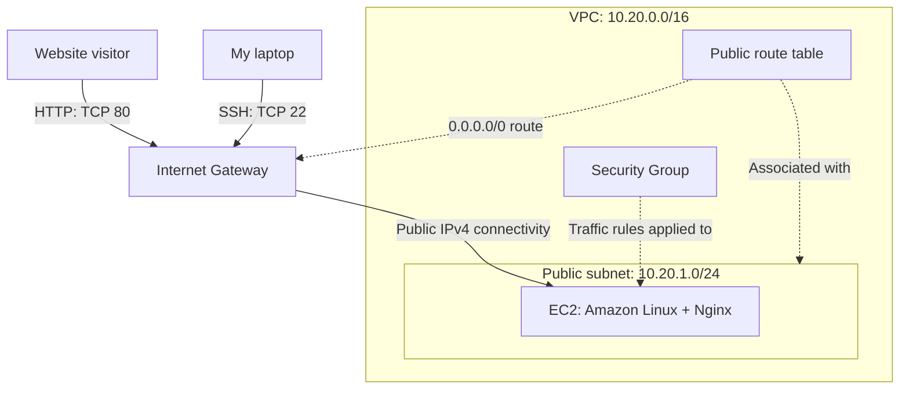

# AWS Cloud Networking & Linux Web Server Lab

A hands-on learning project by Umega Eshan.

I deployed a static website on an Amazon EC2 instance inside a
custom VPC. This project helped me practise AWS networking,
Linux administration, SSH, Nginx and basic troubleshooting.

## Architecture

| Component | Configuration |
|---|---|
| AWS Region | Mumbai — ap-south-1 |
| VPC | cloud-lab-vpc-v1 — 10.20.0.0/16 |
| Public subnet | cloud-lab-public-v1 — 10.20.1.0/24 |
| Internet Gateway | cloud-lab-igw-v1, attached to the VPC |
| Route table | cloud-lab-public-rt-v1, associated with the public subnet |
| EC2 instance | cloud-lab-web-v1 — t3.micro |
| Operating system | Amazon Linux 2023 |
| Web server | Nginx |
| Website directory | /usr/share/nginx/html |

The EC2 instance is located in the public subnet and has a public
IPv4 address. The subnet's route table provides a route to the
Internet Gateway. A security group controls traffic to the instance.

## Network Diagram

Solid arrows show simplified connection paths.
Dotted arrows show configuration relationships.

- HTTP access is allowed from any IPv4 address.
- SSH access is restricted to my selected public IPv4 address.
- The route table also contains the VPC local route.
- The Internet Gateway is attached to the VPC.
- The EC2 instance has a public IPv4 address.

## Routing

| Destination | Target | Purpose |
|---|---|---|
| 10.20.0.0/16 | local | Routing within the VPC |
| 0.0.0.0/0 | Internet Gateway | Default route for other IPv4 destinations |

## Security Group

| Direction | Protocol / Port | Source or destination |
|---|---|---|
| Inbound | TCP 80 — HTTP | Any IPv4 address |
| Inbound | TCP 22 — SSH | My selected public IPv4 address only, using /32 |
| Outbound | All traffic | Any IPv4 address |

SSH login uses a private key. Private keys and credentials are
excluded from this repository.

The SSH rule must be updated if my public IP address changes.

## Implementation

1. Created a custom VPC and subnet.
2. Attached an Internet Gateway to the VPC.
3. Created a route table with an internet route and associated it
   with the public subnet.
4. Configured HTTP access and restricted SSH access.
5. Launched an Amazon Linux 2023 EC2 instance.
6. Connected from Windows using SSH.
7. Installed Nginx and configured it to start at boot.
8. Replaced the default page with my own index.html.
9. Tested HTTP responses and inspected logs.
10. Copied the website to my laptop using SCP.

## Validation

| Test | Observed result |
|---|---|
| Open the website using the public IP in a browser | Custom page displayed |
| Run curl -I http://localhost on EC2 | HTTP 200 OK |
| Request /missing-page.html | HTTP 404 Not Found |
| Inspect Nginx access logs | Requests and response codes recorded |
| Stop Nginx and check its state | inactive |
| Send a local HTTP request while Nginx is stopped | Connection failed |
| Start Nginx and repeat the request | HTTP 200 OK |
| Inspect the service journal | Stop and start events recorded |

## Troubleshooting: Web Service Unavailable

This was a controlled failure test on my own lab instance.

**Action:** I stopped the Nginx service.

**Symptoms:** The service state became inactive, and a request to
localhost on port 80 failed.

**Cause:** Nginx was not running to accept HTTP connections.
The EC2 instance and SSH service were still running.

**Recovery:** I started Nginx again.

**Verification:** A local HTTP request returned 200 OK.

This taught me that a running EC2 instance does not necessarily
mean its web service is running.

## Troubleshooting: SCP from Windows

I encountered three issues while downloading the website:

- I initially supplied a folder path instead of the private key file.
- OpenSSH rejected the key because its Windows permissions were too broad.
- The local destination folder did not exist.

I corrected the key path, restricted the key's file permissions,
created the destination folder and successfully copied index.html.

## What I Learned

- The relationship between a VPC, subnet, route table and Internet Gateway.
- The difference between routing and traffic permissions.
- The difference between an IAM user and a Linux user.
- How SSH access differs from HTTP access.
- How to install and manage a Linux service.
- The difference between starting a service and enabling it at boot.
- How to interpret HTTP 200, 304 and 404 responses.
- How access logs differ from service lifecycle logs.
- Why localhost testing and external browser testing check different paths.
- How to transfer files securely with SCP.

## View the Website Locally

Open website/index.html in a browser.

This displays the local HTML file. It does not recreate or test
the AWS infrastructure.

## Current Limitations

- This is a learning lab with one EC2 instance.
- Infrastructure was created manually through the AWS console.
- The demonstrated website uses HTTP; HTTPS has not been configured.
- No load balancer, automatic failover or Auto Scaling is implemented.
- No automated deployment or monitoring alerts are included yet.
- The public IP may change after stopping and starting the instance.
- AWS resources may incur charges; a live demo is not guaranteed to remain available.

## Planned Improvements

- Add an architecture diagram and screenshots.
- Improve the demonstration page.
- Automate infrastructure deployment.
- Add HTTPS and monitoring.
- Extend the design to explore availability and private subnets.