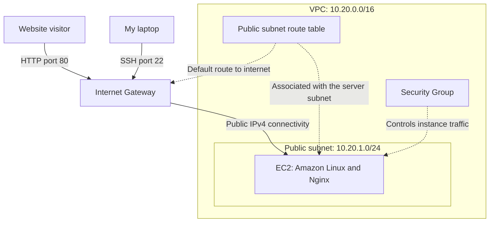
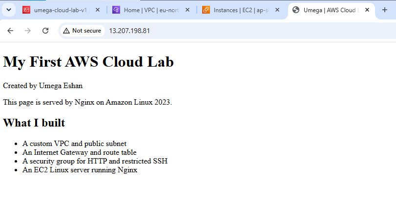
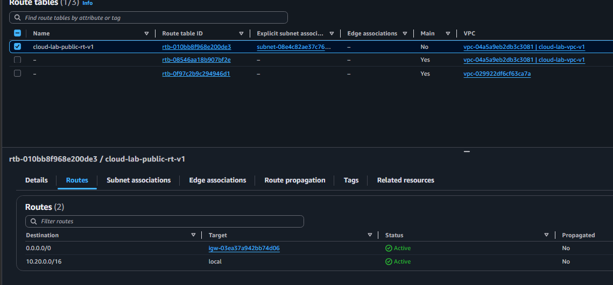
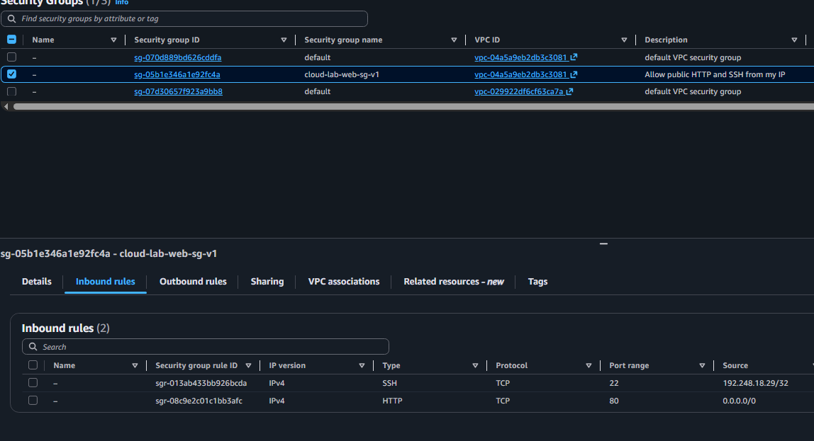
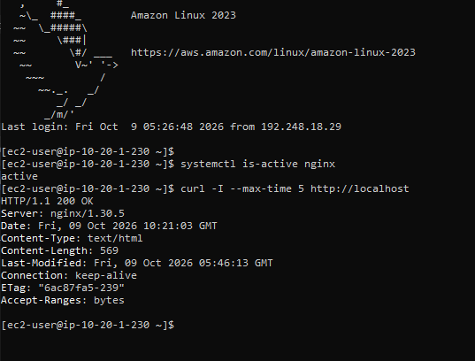

# AWS Cloud Networking & Linux Web Server Lab

A hands-on learning project by **Umega Eshan**.

I deployed a static website on an Amazon EC2 instance inside a custom VPC. This project helped me practise AWS networking, Linux administration, SSH, Nginx and basic troubleshooting.

I also performed a controlled web-service failure test: I stopped Nginx, observed the failed HTTP connection, restored the service and verified recovery using HTTP responses and service logs.

## Architecture

| Component | Configuration |
|---|---|
| AWS Region | Mumbai — `ap-south-1` |
| VPC | `cloud-lab-vpc-v1` — `10.20.0.0/16` |
| Public subnet | `cloud-lab-public-v1` — `10.20.1.0/24` |
| Internet Gateway | `cloud-lab-igw-v1`, attached to the VPC |
| Route table | `cloud-lab-public-rt-v1`, associated with the public subnet |
| EC2 instance | `cloud-lab-web-v1` — `t3.micro` |
| Operating system | Amazon Linux 2023 |
| Web server | Nginx |
| Website directory | `/usr/share/nginx/html` |

The EC2 instance is located in the public subnet and has a public IPv4 address. The subnet's route table provides a route to the Internet Gateway. A security group controls permitted traffic to the instance.

## Network Diagram



Solid arrows show simplified connection paths. Dotted arrows show configuration relationships, not additional network hops. The route-table association applies to the subnet containing the server; the Internet Gateway is attached to the VPC.

- HTTP access is allowed from any IPv4 address on TCP port **80**.
- SSH access is restricted to my selected public IPv4 address on TCP port **22**.
- The route table also contains the VPC local route.
- The instance needs both network connectivity and a running web server to serve the page.

## Routing

| Destination | Target | Purpose |
|---|---|---|
| `10.20.0.0/16` | `local` | Routing within the VPC |
| `0.0.0.0/0` | Internet Gateway | Default route for other IPv4 destinations |

Routing determines where traffic goes. Security-group rules determine which traffic is allowed. An internet route alone does not grant HTTP or SSH access.

## Security Group

| Direction | Protocol / Port | Source or destination |
|---|---|---|
| Inbound | TCP 80 — HTTP | `0.0.0.0/0` — any IPv4 address |
| Inbound | TCP 22 — SSH | My selected public IPv4 address, using `/32` |
| Outbound | All traffic | `0.0.0.0/0` — any IPv4 address |

SSH login uses a private key. Private keys and credentials are excluded from this repository. The SSH source rule must be updated if my public IP address changes.

## Implementation

1. Created a custom VPC and subnet.
2. Attached an Internet Gateway to the VPC.
3. Created a route table with an internet route and associated it with the public subnet.
4. Configured HTTP access and restricted SSH access.
5. Launched an Amazon Linux 2023 EC2 instance with a public IPv4 address.
6. Connected from Windows using SSH.
7. Installed Nginx and configured it to start at boot.
8. Replaced the default page with my own `index.html`.
9. Tested HTTP responses and inspected logs.
10. Performed a controlled Nginx stop/start recovery test.
11. Copied the website to my laptop using SCP.

## Validation

These results were observed during the lab; they do not indicate continuous availability.

| Test | Observed result |
|---|---|
| Open the website using the public IP in a browser | Custom page displayed |
| Run `curl -I http://localhost` on EC2 | HTTP `200 OK` |
| Request `/missing-page.html` | HTTP `404 Not Found` |
| Inspect Nginx access logs | Requests and response codes recorded |
| Stop Nginx and check its state | `inactive` |
| Send a local HTTP request while Nginx is stopped | Connection failed |
| Start Nginx and repeat the request | HTTP `200 OK` |
| Inspect the service journal | Stop and start events recorded |

### Commands Used to Inspect the Server

Run these commands in the EC2 Linux terminal:

```bash
# Check whether the web-server service is running.
systemctl is-active nginx

# Request HTTP response headers from this EC2 instance itself.
curl -I --max-time 5 http://localhost

# Follow incoming web requests. Press Ctrl+C to stop following the log.
sudo tail -f /var/log/nginx/access.log

# Display the latest 20 Nginx service-journal entries.
sudo journalctl -u nginx -n 20 --no-pager
```

`localhost` refers to the machine where the command runs. A successful localhost request checks the local web service; it does not verify the external route or security-group rules. Opening the page from an external browser tests external access as well.

## Troubleshooting: Web Service Unavailable

This was a controlled failure test on my own lab instance.

**Action:** I stopped the Nginx service using `sudo systemctl stop nginx`.

**Symptoms:** The service state became `inactive`, and a request to `localhost` on port 80 failed with `curl: (7) Failed to connect`.

**Cause:** Nginx was not running to accept HTTP connections. The EC2 instance and SSH service were still running. Stopping Nginx did not remove the security group's HTTP rule.

**Recovery:** I started Nginx using `sudo systemctl start nginx`.

**Verification:** A local HTTP request returned `200 OK`. The service journal recorded the stop and start events.

This taught me that a running EC2 instance does not necessarily mean its web service is running. SSH and HTTP use separate services and ports, so I could still administer the server through SSH while Nginx was stopped.

## Troubleshooting: SCP from Windows

I encountered three issues while downloading the website:

- I initially supplied a folder path instead of the private key file.
- OpenSSH rejected the key because its Windows permissions were too broad.
- The local destination folder did not exist.

I corrected the key path, restricted the key's file permissions, created the destination folder and successfully copied `index.html`.

## What I Learned

## Screenshots

### 1. Website Hosted on EC2
The custom website accessed through the instance's public IPv4 address.



### 2. Public Subnet Routes
The VPC local route and the default route to the Internet Gateway.



### 3. Security Group Rules
HTTP access on port 80 and SSH access restricted to a selected IPv4 address on port 22.



### 4. Nginx Health Check
The service state and a successful local HTTP response.



### 5. Nginx Access Log
HTTP requests and their response codes recorded by Nginx.


## View the Website Locally

Open [`website/index.html`](website/index.html) in a browser.

This displays the local HTML file. It does not recreate or test the AWS infrastructure.

## Current Limitations

- This is a learning lab with one EC2 instance.
- Infrastructure was created manually through the AWS console.
- The demonstrated website uses HTTP; HTTPS has not been configured.
- No load balancer, automatic failover or Auto Scaling is implemented.
- No automated deployment or web-service monitoring alerts are included yet.
- The public IP may change after stopping and starting the instance.
- AWS resources may incur charges; a live demo is not guaranteed to remain available.

## Planned Improvements

- Add screenshots showing the architecture configuration and test results.
- Improve the demonstration page.
- Automate infrastructure deployment.
- Add HTTPS and web-service monitoring.
- Extend the design to explore availability and private subnets.
